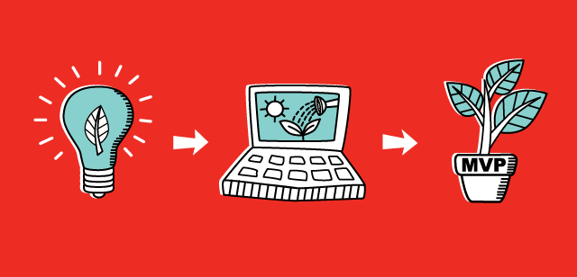
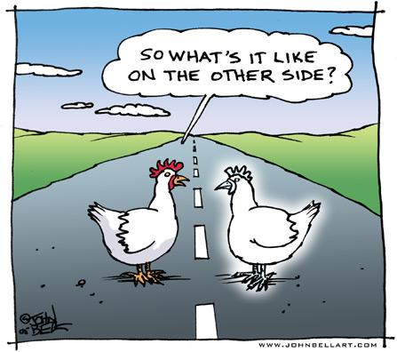
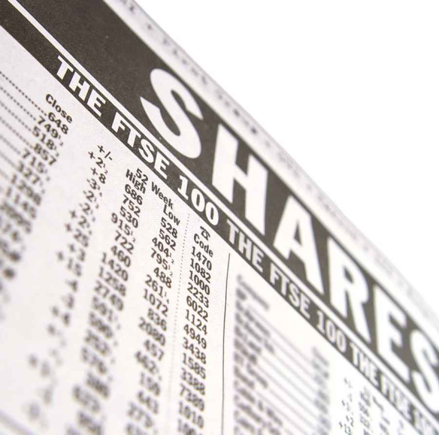

# From an idea to a MVP

---

# Who and Why

---

## You

---

## Me

* Martin Van Aken - [joyouscoding.com](http://www.joyouscoding.com)
* Software Developer since 15 years
* Co-founder of [PullReview](http://pullreview.com)
* Coach at [LeWagon](http://www.lewagon.org)
* CTO at [Bluesquare](http://www.bluesquarehub.com)

---

> I'm from the other side. I'm here to help.

---

## Why

* Moved my activity from big companies to startups
* Met a lot of business owners those last 6 years
* This is a summary from those discussions

---

## Agenda

1. What is an MVP
1. Technology brief
1. Developers
1. Getting software done

--

# 1. What is an MVP

---

## Definition

* **Minimal**: not a dream, not even a v1
* **Viable**: able to attract/interest users
* **Product**: providing value (entertainment/productivity/whatever)

---

## What it's not

* A fully defined product
* A technical test

---

### It has to be used by real users to be useful

---

## Why

---

### Validating your business (**audience, problem, solution**) as soon as possible

---

## In the beginning

* An audience
* with a problem
* that is valuable and possible to solve

---

## Identify the audience

---

### Some bad examples

* "This is for everyone"
* "We have three types of customers"

Note:
The closest thing I know to an "app for everyone" is Facebook. You are not Facebook (and even they started with a quite specific audience)

---

### Some good cases

* Pick an audience you know
* Be careful that **you are not your audience** even if you are **in** your audience

---

### Being specific is good

* Easier to find ("watering hole")
* More consistent in their problems
* You can't reach "everyone" anyway

---

### My take

The **knowledge of your audience** is the biggest thing you bring as a business founder (much more important than your idea).

Note:
I failed miserably at creating a product for HR (I know nothing about HR)
My current company make software for public health. Our CEO and most of our business people are public health specialists

---

## Interlude: About 'ideas'

* We talk a lot about ideas
* How to protect them
* How valuable their are

---

### The reality

> "Nobody is going to steal your shitty idea"

> Adeo Ressi

---

### They are not so valuable

* They are only about the solution
* They will probably change
* Execution matter much more

---

### You should talk more than protect them

* Get feedback
* You are not your idea
* You have much more than your idea

---

### What is -your- audience ?

---

## Identify the problem

---

### What we are looking for

* It may not be the one you think
* There may be a bigger one
* Needs to be there AND worth solving

---

### Problem interviews

* 15-30 minutes interviews
* In person or call (avoid surveys)
* 12-15 interviews

---

### Example Script

* Welcome
* Demographics / Ice breaker
* Story
* Problem Ranking
* Today's situation
* Thanks and ask

---

### Efficiency

* 15 times 30 minutes = just **7.5 hours**
* After 6-8, people start repeating themselves.
* That's **very cheap** to validate your business

---

### Added benefits

* Start connecting to your audience
* Create a possible alpha user list

**No reason not to do them.**

---

### Fail fast

>  I understand you don't want to hear your idea is bad (or that you are not solving any problem). But let's be honest - if it is actually bad, better to know it as early as possible

---

### What problem are -you- attempting to solve?

---

## Identify a solution

---

### Ask the prospect to dream

* Let's imagine that this is working
* Would it solve your problem?
* Would you pay for it?

---

### Mockups

---

### Mockups

* Create a story board on paper
* **Play it** before your prospect
* Updating mockup is incredibly **cheap**
* Those will be useful for later anyway

---

## Audience, Problem, Solution

---

### Pitch as a summary

---

### Example 1

My company, **LeWagon** 
is developping **a 9 week coding bootcamp** 
to help **entrepreneurs** 
to **get their first MVP out** 
by **developing it themselves with our coaches help**

---

### Example 2

My company, **Bluesquare** 
is developping **Web Application** 
to help **ministries of health in low income countries** 
to **encourage good behaviour from health centers** 
by **giving them money based on the value they provide to the population**

---

### Let's try!

--

# 3. Technology brief

---

---

### What language/technology should I use for my project?

> 99% of the project does not have any specific technology requirement - ie, on the tech side, your project is the same as many others

Note:
That's good BTW

---

### Two rules

- One that is known by your developer
- One that is popular

That's all.

--

# 4. Developers

---

## Technical Cofounders

> I'm starting a band. I can't really play any instrument or sing, so I'm looking for a few musical co-founders.

> [Ryan Greenberg](https://twitter.com/greenberg/status/204294460421586947)

---

### Are you (really) looking for a Cofounder? (1)

Notes:
If you are not ready to let shares go, you’re not looking for a Cofounder - you are looking for a developer but you don’t want to pay.

---

### What about 50%?

I'll be building the software, what are you bringing?

Note:
There are a lot of good answers to that question, but "the idea" is not one of them.

---

### Shares value

Note:
As a starting company, your stock is worth basically nothing - in a sector which is rewarding well, this is a difficult situation.

---

### Are you (really) looking for a Cofounder? (2)

If you have defined everything business-wise, you’re not looking for a Cofounder - you are looking for a developer but you don’t want to pay.

Note:
There is nothing wrong in having people execute what you decide - just don't call them cofounders.

---

### You are not going to find one

Notes:
Less 25% of founders are technical. Most of those have ideas themselves they want to make happen.

---

### Summary (1)

> You are competing with other people with ideas - work your pitch. Show your unfair advantage. Think about what would make someone invest her sweat and skills at your company and not someone's else.

---

### Summary (2)

> You can't bet your business on finding a technical cofounder in a specific amount of time

---

## Freelances and agencies

---

### Pros

* Used to deliver
* Experimented
* Can stop/encore when you want
* Can switch for other skills

---

### Cons

* Hopping between projects
* Expensive (day rate ~ 500€)
* Quickly to 5-10K

---

## Employees

---

### Pros

* Dedicated
* Depends on experience level

---

### Cons

* Single set of skills
* Not easy to let go/start again
* Expensive (total)
* Single bullet

---

## General recommandations

Freelances are the safest bet (best value/speed for money to get started)

Note:
They get expensive really fast, which means you need to optimize their time.

--

# 5. Getting Software Done

---

## The Grim Situation

---

### The Disaster Recipe

* Software is expensive
* Business changes
* Business owners are bad at requirements
* Developers are bad at estimations
* Business owners and developers are not speaking the same language

---

### Some statistics

Software costing 15M+ are typically:

* 7% late
* 45% overbudget
* 44% done

[McKinsey Study](http://blogs.gartner.com/mark_mcdonald/2012/10/29/mckinsey-report-highlights-failure-of-large-projects-why-it-is-better-to-be-small-particularly-in-it/)

---

---

### Size matters

The more complex the software, the biggest problems we get in requirements and estimations.

This is not linear - it's exponential.

---

### Fixed price

* Looks like a good idea
* Almost impossible for all but the simplest (= shortest) projects
* Risky: Who decide if/when it is "done"?
* Require very detailed specification
* Risky (2): Who can say it's per the specification or not?

---

### Collaboration vs Contracts

> Remember that every minute spent arguing over who is right is a minute lost for your project. Be sure it's worth it.

---

## What works

* Keep the project small
* Split them into smaller tasks
* Discuss on working software more than requirements
* Every task should have a user-observable result
* Rinse & repeat

---

## User Stories

---

### Definition

* A way to describe a single functionality of your software
* One sentence

---

### Template

As a **user category** I want **given functionality** so I can get **benefit**

---

### Why

* Simple
* Put the user first
* Observable
* Force to think about the benefit

---

### Example (AirBnB)

> As a **tourist** I want **see a list of flat available in the city I'm going to with their rate & location** so I can **see the one best for my own tastes & price range**

---

### Example (Accounting Software)

> As a **company owner or freelance** I want **see a list of my unpaid invoices** so I can  **get them paid quicker**

---

## Mockups (again)

---

### What

* Show how the application should look like
* Show the interactions (clicking here leads there)
* It should not be pretty (big boxes are good)

[Great example](https://www.youtube.com/watch?v=GrV2SZuRPv0)

---

### Why

* Helps a lot understanding the stories
* Give design guidelines
* Much better specification than a long explanation

---

### Inspiration

* Look at existing sites
* Doing things the same way as others helps everyone
* Keep it simple

---

### Mobile

* More mobile than desktop traffic today
* When doing mockups, think about small screens!
* "Mobile first" is actually good: force to limit what you see on a single screen

Note:
Choices are difficult, but they lead to better designs

---

## Short iterations

---

### Setup

* Create a list of stories
* Prioritize them

---

### Progress

* Developer take each story one after the other
* Question are asked when needed (requires collaboration)
* Software is deployed regularly

---

### Demo

* Demo every X days (not after X stories) - X < 10
* Discuss of the stories done, give feedback
* Rinse and repeat

---

### Pros

* Feedback loop is short
* You see (and test!) your software evolving week after week
* Easier to steer the course
* Any misunderstanding will be catched quickly

---

### Cons

* You need to work to create those "small stories"
* You don't have a clear date when the software will be "done"...

Note:
... but you would not have it anyway

---

## Some bad signs

* Your developer is talking in technical terms (setting up a database, validating something, etc)
* You are not seeing a working version of your software on a regular basis

Note:
Real horror story: an entrepreneur in Brussels paid more than 30K to have an app delivered, and had still nothing in his hands 6 months after having started...

---

## We're talking about an MVP

* Doing this will require you to split/axe your initial idea to something much humbler
* Think of it as a first step
* Put users on it, collect their feedback
* Rinse & Repeat

Note:
Better to lose 2-5K than 50K

---

## Tooling

* [Trello](trello.com) for User Stories follow up
* Pen & Paper for mockups

--

## Thanks!

### Any feedback is most welcome: [martin@joyouscoding.com](martin@joyouscoding.com)

---

## References

Most of this comes from various sources:

* Ash Maurya "Running Lean"
* Eric Ries "The Lean Startup"
* Steve Blank "Four Steps to Epiphany"
* Adeo Ressi "One sentence pitch"
* [Problem interview scripts](http://startitup.co/guides/285/problem-interview-script)
* Slides are available here [joyouscoding.com/workshop-mvp/](http://joyouscoding.com/workshop-mvp/)
* [Technical cofounders](https://techcrunch.com/2012/04/15/stop-looking-for-a-technical-co-founder/)